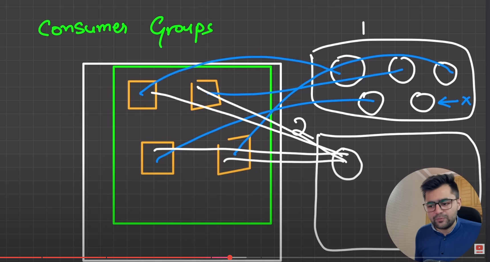

# About Kafka
Kafka is used for event streaming. For example: payments, financial transactions, monitoring and logging, stock market, ETL platforms, logistics and maps.

It combines three key capabilities:
1. To publish ( write) and subscribe to (read) streams of events, including conitnuous import/export of your data from other systems.
2. To store streams of events durably and reliably for as long as you want.
3. To process streams of events as they occur or retrospectively.

All this is ditributed, highly scalable, elastic, fault-tolerant, and secure manner.

## What is the problem being solved?
To track real-time events. We cannot write everything to DB because DB also has its limitations. So we can store these large amount of events in a queue that can be consumed and be updated to the DB after some time. This can be used in large-scale chat appliations and for real-time updates and logging as in coralogix etc. 

## How does Kafka work in a nutshell?
Kafka is a distributed system consisting of servers and clients that communicate via a high-performance TCP network protocol. 

Servers:- Kafka is run as a cluster of one of more server that can span over multiple datacenters or cloud regions. Some of these servers form the Storage layer and are called as brokers. Other servers run "Kafka Connect" to continuously import and export data as event streams to integrate Kafka with your existing systems such as relational database as well as other Kafka clusters. 

Clients:- It is generally what we want. This helps in reads, writes and process streams of events in parallel etc.

## Main concepts and terms:
1. Event: It is a record that something happened and you want to capture it. It has a {key, value, timestamp and optional metadata}
2. Producers: Client applications that publish events to kafka and consumers are those that subscribe to (read and process) these events. Producers and Consumers are decoupled and are not dependent on each other. Producers do not have to wait for consumers. 
3. Topics: Events are organized and durably stored in topics. A topic is similar to a folder in a filesystem, and the events are the files in the system. Topics in Kafka are always multi-producer and multi-subscriber. Events in a topic can be read as often as needed, events are not deleted after consumption. Instead we define retention period of Events though a per-topic configuration setting. Topics are partitioned and are spead over a number of "buckets" located on different kafka brokers. Each topic can have multiple partitions, check example below
4. When a new event is published to a topic, it is actually appended to one of the topic's partitions. Events with the same event key (e.g., a customer or vehicle ID) are written to the same partition, and Kafka guarantees that any consumer of a given topic-partition will always read that partition's events in exactly the same order as they were written.

For example: Consider zomato, the kafka server will have multiple topics like "rider updates", "restaurant updates" etc. Consumer will subscribe to a topc and listen to events passed through the respective topic. Producer controls to which topic a particular event will go to. Topics can then further be partitioned on any parameters like south-india region data, noth-india region etc. A consumer can subscribe to a single partition as well.

## Rule
1 consumer can read from multiple partitions but 1 partition cannot be read by two or more consumers. 

p0,p1,p2,p3,p4 } ka data can be read by a single consumer
p0 } ka data cannot be read by C1,C2,etc. 

Multiple consumers cannot read from a single partition (present in the topic)

---
To solve this, CONSUMER GROUPS were created.
So self-balancing of consumers is done at consumer group level


## Kafka APIs:
In addition to CLI tooling for management and administration tasks, Kafka has 5 core APIs for Java and Scala.
1. The Admin API to manage and inspect topics, brokers, and other Kafka objects.
2. The Producer API to publish (write) a stream of events to one or more Kafka topics.
3. The Consumer API to subscribe to (read) one or more topics and to process the stream of events produced to them.
4. The Kafka Streams API to implement stream processing applications and microservices. It provides higher-level functions to process event streams, including transformations, stateful operations like aggregations and joins, windowing, processing based on event-time, and more. Input is read from one or more topics in order to generate output to one or more topics, effectively transforming the input streams to output streams.
5. The Kafka Connect API to build and run reusable data import/export connectors that consume (read) or produce (write) streams of events from and to external systems and applications so they can integrate with Kafka. For example, a connector to a relational database like PostgreSQL might capture every change to a set of tables. However, in practice, you typically don't need to implement your own connectors because the Kafka community already provides hundreds of ready-to-use connectors.

## Implementation:
### SETUP

1. run docker application via ```sudo systemctl status docker```

2. In another terminal map docker to run with zookeeper on port 2181 ```docker run -p 2181:2181 zookeeper```

3. Run kafka on Docker (use private IP) using : 
```
sudo docker run -d --name kafka \
  -p 9092:9092 \
  -e KAFKA_ZOOKEEPER_CONNECT=192.168.1.13:2181 \
  -e KAFKA_ADVERTISED_LISTENERS=PLAINTEXT://192.168.1.13:9092 \
  -e KAFKA_LISTENER_SECURITY_PROTOCOL_MAP=PLAINTEXT:PLAINTEXT \
  -e KAFKA_OFFSETS_TOPIC_REPLICATION_FACTOR=1 \
  -e KAFKA_BROKER_ID=1 \
  -e KAFKA_DELETE_TOPIC_ENABLE=true \
  confluentinc/cp-kafka
```
this command will return the current docker container id 

4. To stop the kafka container, run ```sudo docker stop kafka```

### CODE BASE:

* install yarn and kafkaja
* Inside the folder, do ```yarn init``` to start the nodejs repo.
* create admin.js 
* create client.js
* create producer.js
* create consumer.js

```
//admin.js
const {kafka} = require('./client')

async function init() {
  const admin = kafka.admin();
  console.log("Admin Connecting...");
  admin.connect();
  console.log(`Admin connected!`);
  console.log(`Creating Topic: rider-updates`)
  await admin.createTopics({
    topics: [
      {
        topic: "rider-updates",
        numPartitions: 2,
      },
    ],
  });
  console.log(`Topic created!`)
  console.log(`Disconnecting Admin`)
  await admin.disconnect();
}

init();
```

```
//client.js
const { Kafka } = require("kafkajs");

exports.kafka = new Kafka({
  clientId: 'my-app',
  brokers: ['192.168.1.13:9092'],
});
```

```
//producer.js
const {kafka} = require('./client')

async function init(){
    const producer = kafka.producer();
    console.log(`Connecting Producer...`);
    await producer.connect();
    console.log(`Producer connected`)

    await producer.send({
        topic: 'rider-updates',
        messages: [
            {
                partition: 0,
                key: "location-update",
                value: JSON.stringify({name: "Tony Stark", loc: "SOUTH"}),
            },
        ],
    });
    await producer.disconnect();
    console.log(`Producer disconnected`)
}

init();
```
```
//consumer.js
const {kafka} = require('./client');

async function init(){
    const consumer = kafka.consumer({
        groupId: "user-1",
    })
    console.log(`Connecting to consumer..`)
    await consumer.connect();
    console.log(`Consumer connected`)
    await consumer.subscribe({topics: ['rider-updates'], fromBeginning: true});

    await consumer.run({
        eachMessage: async ({ topic, partition, message, heartbeat, pause }) => {
            console.log(`[${topic}]: PART:${partition}}:`,message.value.toString());
        },
    });
}

init();
```